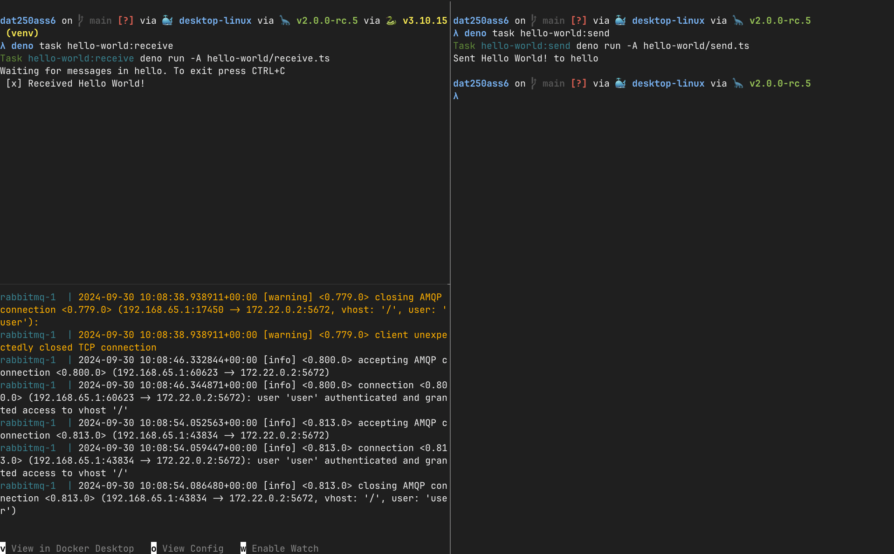
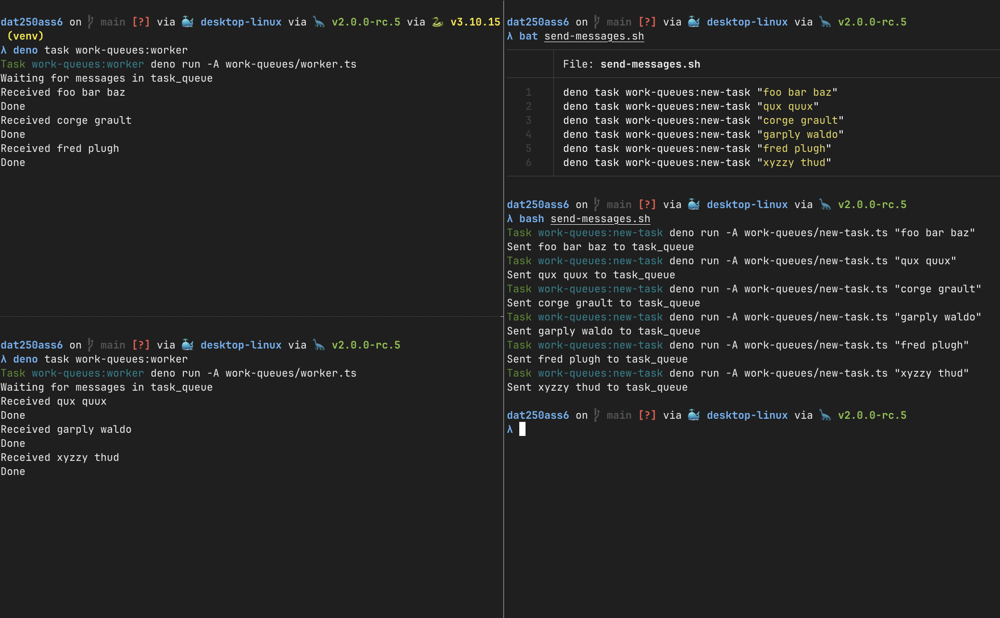
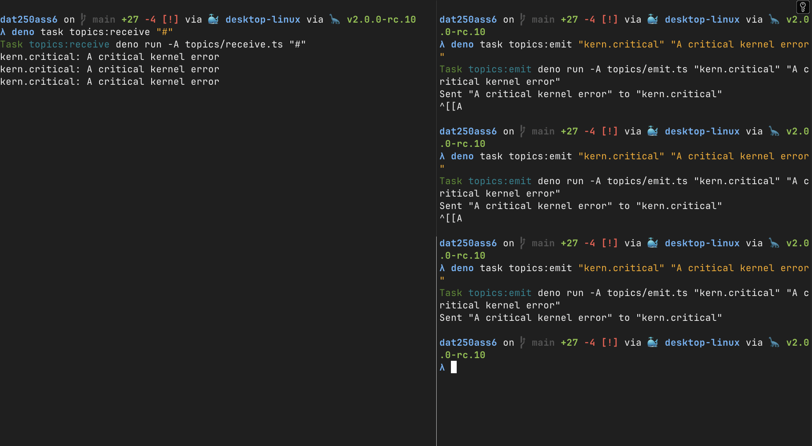

# Expass 6

## Prerequisites

- `deno`
- `docker` (with compose)

## Experiment 2

### How to run

1. Start the RabbitMQ server

```sh
docker compose up -d
```

2. Start the receiver

```sh
deno task hello-world:receive
```

3. Start the sender

```sh
deno task hello-world:send
```

#### Screenshot



## Experiment 3

### How to run

1. Start the RabbitMQ server

```sh
docker compose up -d
```

2. Start the receiver

```sh
deno task work-queues:worker
```

3. Start the sender

```sh
deno task work-queues:new-task "Some task
# or use the script
#bash work-queues/send-messages.sh
```

#### Screenshot



## Experiment 4

### How to run

1. Start the RabbitMQ server

```sh
docker compose up -d
```

2. Start the receiver

```sh
deno task topics:receive
```

3. Start the sender

```sh
deno task topics:emit "kern.critical" "A critical kernel error"
```

#### Screenshot


